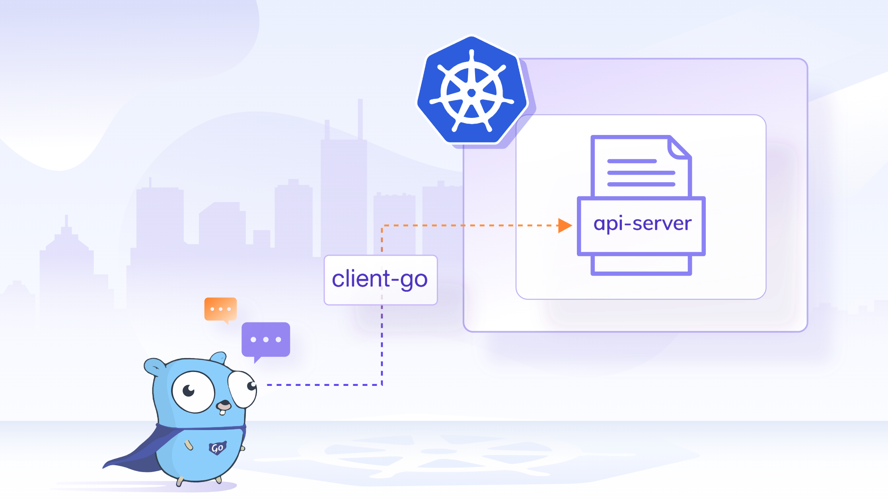

# Sample client-go application to talk to a Kubernetes Cluster



## Client Go

client-go is a lightweight and efficient programming library developed by Google, primarily for building scalable, high-performance network applications. It serves as a crucial tool for developers who need to interact with Kubernetes, offering a simple and powerful way to create clients for Kubernetes clusters.

client-go exposes some interfaces that can be used by clients to interact with Kubernetes API server. client-go is a typical web service client library that supports all API types that are officially part of Kubernetes. It can be used to execute the usual REST verbs:

- Create
- Get
- List
- Update
- Delete
- Patch

## API library

The Kubernetes API library, often referred to as the k8s.io/api package in Go, is a fundamental component for developers working with Kubernetes. It provides a comprehensive set of Go language bindings for Kubernetes' API resources, allowing developers to programmatically interact with Kubernetes clusters.

With this library, developers can easily create, manage, and customize Kubernetes resources such as pods, services, deployments, and more, using Go code. It abstracts the complexities of communicating with the Kubernetes API server, making it simpler to build applications that automate and orchestrate containerized workloads within Kubernetes environments.

Developers can leverage this library to retrieve information from Kubernetes, update resources, and even create custom controllers and operators that extend Kubernetes' functionality to meet specific application requirements. Overall, the Kubernetes API library simplifies Kubernetes resource management and integration for Go developers, contributing to the flexibility and extensibility of Kubernetes-based solutions.

## apimachinery

Scheme, typing, encoding, decoding, and conversion packages for Kubernetes and Kubernetes-like API objects. This library is a shared dependency for servers and clients to work with Kubernetes API infrastructure without direct type dependencies. Its first consumers are k8s.io/kubernetes, k8s.io/client-go, and k8s.io/apiserver. (Taken from Official docs https://pkg.go.dev/k8s.io/apimachinery#section-readme)

## How to build the application

To build linux binary for the code written in Mac run below command 

```bash
🔥🔥🔥 $ GOOS="linux" go build
```

Run `docker build` command from the root of the application

```bash
🔥🔥🔥 $ docker build -t clientgo:0.0.1 .
```

Then tag and push the image to docker Hub

```bash
🔥🔥🔥 $ docker tag clientgo:0.0.1 aswinayyolath/clientgo:0.0.1
```

```bash
🔥🔥🔥 $ docker push aswinayyolath/clientgo:0.0.1
```

In the K8S cluster create role and rolebinding such that default Service account should be able to list pods,deployments,services

```bash
🔥🔥🔥 $ kubectl create role listresource --resource pods,deployments,services --verb list


role.rbac.authorization.k8s.io/listresource created
```

```bash
🔥🔥🔥 $ kubectl create rolebinding listresource --role listresource --serviceaccount testclientgo:default


rolebinding.rbac.authorization.k8s.io/listresource created
```

Create deployment

```bash
 kubectl create deployment clientgoapp --image aswinayyolath/clientgo:0.0.1
```

```bash

🔥🔥🔥 $ kubectl get pods -w
NAME                           READY   STATUS      RESTARTS       AGE
clientgoapp-6cb444bd4c-7vdmn   0/1     Completed   5 (101s ago)   3m20s
```

Clinet-go application running fine

```bash
🔥🔥🔥 $ oc logs clientgoapp-6cb444bd4c-7vdmn -f
 Error stat /Users/aswina/.kube/config: no such file or directory building config from flag
========Pods========
clientgoapp-6cb444bd4c-7vdmn
nginx
redis-6c46ff6454-px2sk
redis-6c46ff6454-sbmph
redis-6c46ff6454-wrxtl

========Deployments========
clientgoapp
redis
========Services========
my-service
🔥🔥🔥 $
```

## Kubernetes Objects/Resource in Go

If any go struct implements `runtime.Object` interface from apimachinery package then we can say that it's a kubernetes object.

## Kubernetes custom controller

A Kubernetes custom controller is a piece of software that you can create and run within a Kubernetes cluster to automate the management of custom resources. Let me break that down:

**Kubernetes Cluster**: Kubernetes is a system for managing containerized applications, helping you deploy, scale, and manage containerized applications. A Kubernetes cluster is a set of machines (nodes) that run containerized applications.

**Custom Resources**: In Kubernetes, you can define your own custom types of objects called "custom resources." These are extensions of the basic Kubernetes objects (like pods, services, and deployments) and are specific to your application or use case.

**Custom Controller**: A custom controller is like a specialized manager that watches for changes to custom resources in your cluster. When it detects a change, it takes automated actions based on the desired state you've defined for those resources.


## Informer

In Kubernetes, an "Informer" is a tool or mechanism that helps your custom controllers stay up-to-date with the current state of objects in the cluster.

**Objects in Kubernetes**: In Kubernetes, everything is an object. This includes things like pods, services, and other resources. Each of these objects has a current state, like whether it's running or what configuration it has.

**Informer**: The Informer is like a messenger service for your custom controllers. It constantly watches for changes in the cluster and sends updates to your controllers when something relevant happens.

In Kubernetes, an Informer is part of the client-go library and is used to watch and inform your custom controllers about changes to objects in the cluster. The key difference between the watch() verb and Informers lies in how they handle and deliver updates.

### watch() Verb

- The watch() verb is a lower-level mechanism provided by the Kubernetes API client libraries. It allows you to set up a watch on a particular resource type (e.g., pods, services).
- When you use watch(), you receive a continuous stream of events indicating changes to the specified resource. These events could be additions, modifications, or deletions of objects.
- You, as a developer, need to handle the raw events and decide how to react to them. It often involves parsing the event and implementing the logic to reconcile the desired state with the observed changes.

```go
// Example of using watch() in Go with client-go
watchInterface, err := clientset.CoreV1().Pods("namespace").Watch(context.TODO(), metav1.ListOptions{})
// Handle events from watchInterface
```

### Informer

- Informers are a higher-level abstraction built on top of the watch() verb. They simplify the process of watching and reacting to changes in the cluster by providing a framework for event handling.
- Informers cache the state of objects locally and maintain it up-to-date by handling watch events automatically. This local cache makes it more efficient for controllers to query the current state without making frequent API server requests.
- When you use an Informer, you register callbacks (event handlers) to be invoked when objects change. The Informer takes care of managing the watch stream, updating the local cache, and triggering the appropriate callbacks.

```go
// Example of using an Informer in Go with client-go
informer := informers.NewSharedInformerFactory(clientset, resyncPeriod).Core().V1().Pods().Informer()
// Register callbacks for events
informer.AddEventHandler(cache.ResourceEventHandlerFuncs{
    AddFunc: func(obj interface{}) { /* handle pod creation */ },
    UpdateFunc: func(oldObj, newObj interface{}) { /* handle pod update */ },
    DeleteFunc: func(obj interface{}) { /* handle pod deletion */ },
})
// Start the Informer
informer.Run(stopCh)

```

In summary, while both watch() and Informers are used to observe changes in the cluster, Informers offer a higher-level abstraction by managing local caches and providing convenient callback registration. This simplifies the development of custom controllers and helps ensure that they react efficiently to changes in the Kubernetes objects they manage.

## SharedInformerFactory

The `SharedInformerFactory` in `client-go` is a convenient way to create and manage informers in a Kubernetes controller. It helps in reducing duplicate work and ensures that multiple controllers or components within your application share a common set of informers and caches. Here are some key points explaining the need for `SharedInformerFactory`

#### Resource Efficiency

- Creating and managing informers involves setting up watch mechanisms on Kubernetes resources and maintaining a local cache of objects.
- The `SharedInformerFactory` allows multiple components or controllers within your application to share the same informer and cache instances. This sharing reduces the overhead of redundant watch setups and minimizes the resource usage in your application.

#### Consistent Caching

- When multiple controllers are watching the same resources, it's crucial to maintain a consistent view of the objects across all of them. The shared informer factory ensures that all controllers get updates from the same cache.
- Avoiding redundant caches helps prevent inconsistencies and reduces the likelihood of controllers reacting differently to the same set of changes in the cluster.

#### Code Organization

- The `SharedInformerFactory` promotes clean and organized code by centralizing the creation and management of informers. It serves as a factory for creating informers for different resource types.
- This organization makes it easier to understand, maintain, and extend your codebase, especially when dealing with multiple controllers or components.

#### Resync Period Handling

- Informers often include a resync period, during which they periodically list all objects in the watched resource and update the local cache. The `SharedInformerFactory` allows you to specify a default resync period for all informers created from the factory.
- This centralized handling of resync periods simplifies configuration and ensures consistency across multiple informers.

### dynamic client

In Kubernetes and the client-go library, the `dynamic client` is a feature that allows you to interact with the Kubernetes API server using a generic and dynamic approach. Unlike the traditional client-go clients that are generated based on Kubernetes API resource definitions, the dynamic client allows you to work with resources without requiring pre-generated client code.

Here are some key points about the dynamic client in client-go:

#### Generic Resource Interaction

The dynamic client allows you to work with any Kubernetes resource without having to write specific Go code for each resource type.
This is particularly useful when dealing with custom resources or situations where you might not have the exact resource definition at compile time.

#### Dynamic Resource Discovery

The dynamic client can dynamically discover and work with resources without needing to have explicit Go struct definitions for those resources.
It allows you to interact with resources that might not be known at compile time, making it flexible for scenarios where you deal with custom resources or APIs.

#### Dynamic Resource CRUD Operations

With the dynamic client, you can perform CRUD (Create, Read, Update, Delete) operations on resources dynamically, without requiring statically generated client code.
This is helpful when dealing with resources that are not part of the core Kubernetes API or when working with extensions.
